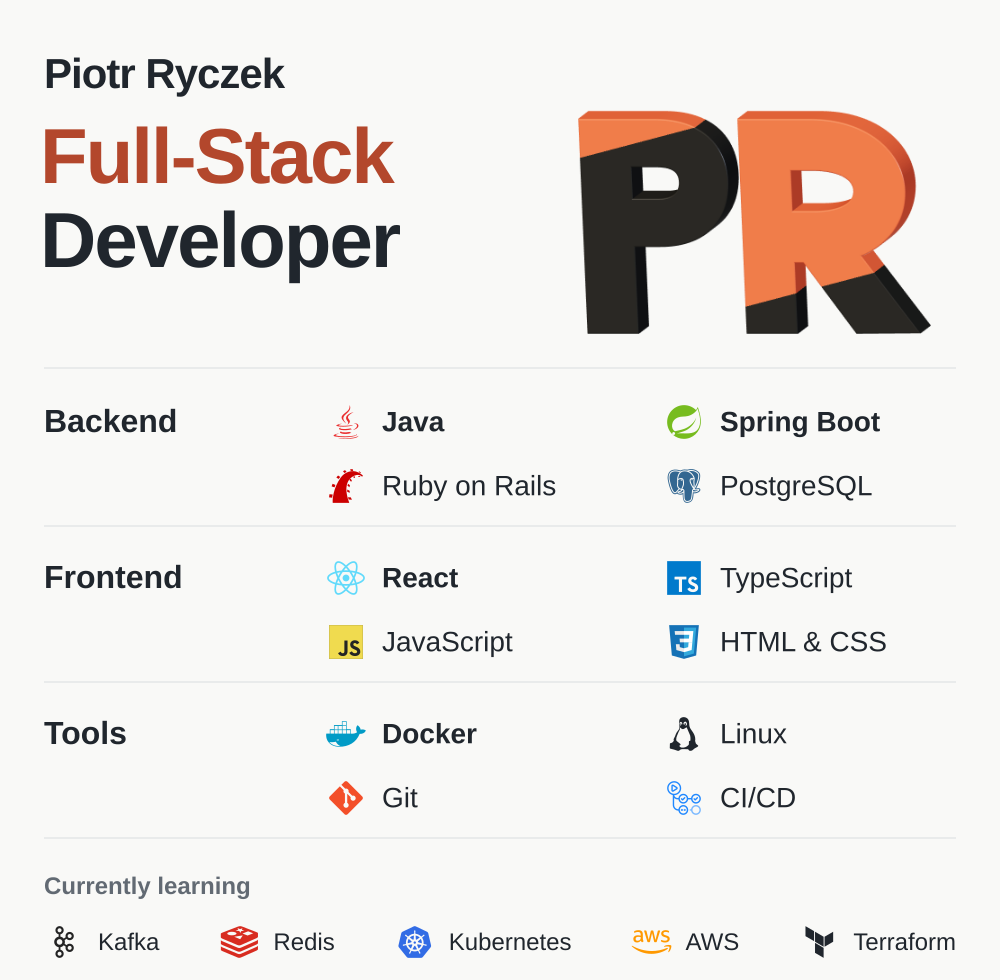

<picture>
  <source media="(prefers-reduced-motion: reduce) and (max-width: 600px)" srcset="assets/profile-static-mobile.svg">
  <source media="(prefers-reduced-motion: reduce)" srcset="assets/profile-static.svg">
  <source media="(max-width: 600px)" srcset="assets/profile-motion-mobile.svg">
  
</picture>

<a href="https://ryczek.dev"><strong>ryczek.dev</strong></a>&nbsp;&nbsp;&nbsp;&nbsp;&nbsp;&nbsp;<a href="https://www.linkedin.com/in/piotrryczek9/"><strong>LinkedIn</strong></a>

